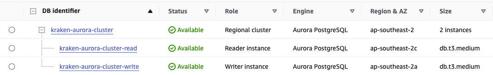

# Aurora PostgreSQL Example

This directory contains configuration to create a PostgreSQL Aurora cluster with two instances – one read and one write – inside an example VPC.

**WARNING**: This example configuration deploys instances using the `db.t3.medium` instance class to save costs across the development and testing process. This instance class **is not recommended for production**. Please bump this up to a more stable class when deploying to a production environment (e.g. `db.r6g.large`) using the `read_instance_class` and `write_instance_class` variables.



## Usage

To deploy the PostgreSQL Aurora cluster, execute the following:

```
terraform init
terraform plan
terraform apply
```

<!-- BEGIN_TF_DOCS -->

## Requirements

| Name                                                                     | Version   |
| ------------------------------------------------------------------------ | --------- |
| <a name="requirement_terraform"></a> [terraform](#requirement_terraform) | >= 1.0.0  |
| <a name="requirement_aws"></a> [aws](#requirement_aws)                   | >= 3.48.0 |

## Providers

No providers.

## Modules

| Name                                                                             | Source                        | Version |
| -------------------------------------------------------------------------------- | ----------------------------- | ------- |
| <a name="module_aws_rds_cluster"></a> [aws_rds_cluster](#module_aws_rds_cluster) | ../../                        | n/a     |
| <a name="module_vpc"></a> [vpc](#module_vpc)                                     | terraform-aws-modules/vpc/aws | ~> 5.0  |

## Resources

No resources.

## Inputs

No inputs.

## Outputs

No outputs.

<!-- END_TF_DOCS -->
